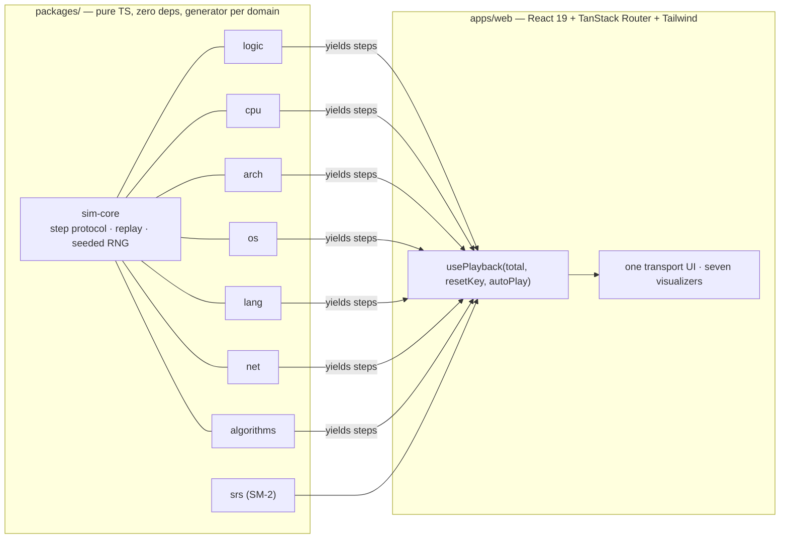

# nand2web

> Learn how computers work, from NAND gates to the web — interactively.

[](https://cs.n10u.jp)
[](https://github.com/subaru-hello/nand2web/actions/workflows/ci.yml)
[](#license)

**nand2web** is an interactive computer-science curriculum. Every concept — from a single NAND gate up to a pipelined CPU, a compiler, an operating-system scheduler, and the TCP handshake — is taught with a **step-by-step visual simulator you drive yourself**. Nothing is a video or a static diagram: each simulator is a real, tested implementation of the thing it teaches, and you scrub through its execution one step at a time.

It's built as a public, from-scratch demonstration of computer-science fundamentals — the kind of ground a degree covers, rebuilt as software you can run.

**→ [cs.n10u.jp](https://cs.n10u.jp)**

## Curriculum

Seven domains, bottom-up — every layer is live and playable, plus a spaced-repetition review deck that ties them together.

| Layer | Module | What you drive |
|---|---|---|
| 1 | [Digital Logic](https://cs.n10u.jp/logic) | NAND → gates → half/full adder → flip-flop → ALU, on real truth tables |
| 2 | [4-bit CPU](https://cs.n10u.jp/cpu) | fetch → decode → execute over a tiny ISA, with an assembler |
| 3 | [Architecture](https://cs.n10u.jp/arch) | a 5-stage pipeline (hazards, forwarding, branch flush) + a set-associative cache |
| 4 | [Operating Systems](https://cs.n10u.jp/os) | FCFS/SJF/RR/MLFQ scheduling + FIFO/LRU/Clock paging + address translation |
| 5 | [Language & Compiler](https://cs.n10u.jp/lang) | source → lexer → parser → AST → live evaluation of a tiny language |
| 6 | [Networking](https://cs.n10u.jp/net) | TCP handshake & teardown, packet encapsulation, a recursive DNS journey |
| 7 | [Algorithms](https://cs.n10u.jp/algorithms) | six sorting algorithms, step-compared side by side |
| ★ | [Review](https://cs.n10u.jp/quiz) | a cross-cutting quiz scheduled by **SM-2 spaced repetition** |

## Architecture

**One playback engine, seven domains.** Every simulator is a pure, dependency-free TypeScript **generator** that `yield`s immutable steps. The React app replays those steps through a single shared playback engine — the domain code never touches the DOM, and the UI never re-implements domain logic.



The contract is small enough to state in one line:

```ts
type Simulation<Step, Result = void> = Generator<Step, Result, void>;
```

A simulator is a generator; `collectSteps()` drains it into an array; `usePlayback()` scrubs that array. Add a domain by writing a generator and a visualizer — the engine, transport controls, keyboard handling, and reduced-motion support come for free.

## Testing

Domain logic is verified with **property-based tests** (fast-check), not just examples — the interesting bugs live at the boundaries, so the suite asserts *invariants* over thousands of generated inputs. A few of the properties that must hold:

- **Sorting** — output is a permutation of the input and is ordered, for every algorithm; stable sorts preserve equal-key order.
- **Architecture** — the pipeline's final register/memory state equals a sequential reference interpreter, across randomly generated programs (including taken branches and stores).
- **OS paging** — FIFO/LRU/Clock match independent reference implementations step for step, including the Clock hand position.
- **Spaced repetition** — the SM-2 ease factor never drops below 1.3 and intervals are monotonic under passing grades:

```ts
it("ease never drops below the SM-2 floor, for any grade sequence", () => {
  fc.assert(fc.property(fc.array(gradeArb, { minLength: 1 }), (grades) => {
    let card = newCard("x", 0);
    for (const g of grades) card = review(card, g, card.due);
    return card.ease >= 1.3;
  }));
});
```

Roughly **200 unit + property tests** across the domain packages, plus a **Playwright** smoke suite that loads all nine routes in a real browser. Both run in CI on every push.

## Tech stack

- **Domains:** TypeScript generators, zero runtime dependencies, one package each
- **App:** React 19, TanStack Router (file-based), Tailwind v4, Vite
- **Persistence:** IndexedDB (via `idb`) — lesson progress & spaced-repetition card state; language preference in `localStorage`
- **Tests:** Vitest + fast-check (property-based) · Playwright (e2e)
- **Tooling:** pnpm workspaces, Biome (lint + format), Node 22
- **Deploy:** Cloudflare Workers (SPA) at [cs.n10u.jp](https://cs.n10u.jp)

## Development

```sh
pnpm install
pnpm dev        # start the web app
pnpm test       # unit + property-based tests (Vitest + fast-check)
pnpm build      # build all packages + the web app
pnpm typecheck  # tsc across the workspace (run after build)
pnpm lint       # Biome
pnpm --filter web e2e   # Playwright smoke across all routes
```

## Deployment

The app is a static SPA served by a Cloudflare Worker (`wrangler.jsonc`, `not_found_handling: single-page-application`) on the custom domain `cs.n10u.jp`. CI runs lint + tests + build + e2e on every push; deploys are gated on a `CLOUDFLARE_API_TOKEN` secret.

```sh
pnpm build && npx wrangler deploy
```

## References

The curriculum stands on the shoulders of the classics:

- *The Elements of Computing Systems* (Nisan & Schocken) — the NAND-to-Tetris path this project is named after
- *Computer Systems: A Programmer's Perspective* (Bryant & O'Hallaron) — architecture, caches, linking
- *Operating Systems: Three Easy Pieces* (Arpaci-Dusseau) — scheduling, virtual memory
- *Crafting Interpreters* (Nystrom) — the lexer → parser → evaluator pipeline
- *Computer Networking: A Top-Down Approach* (Kurose & Ross) — TCP, DNS, encapsulation
- SuperMemo **SM-2** algorithm — the spaced-repetition scheduler behind the review deck

## License

MIT
